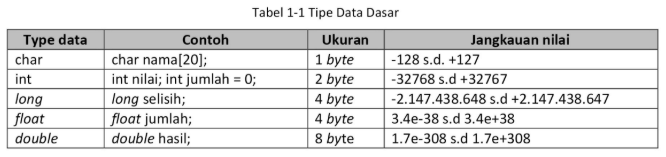
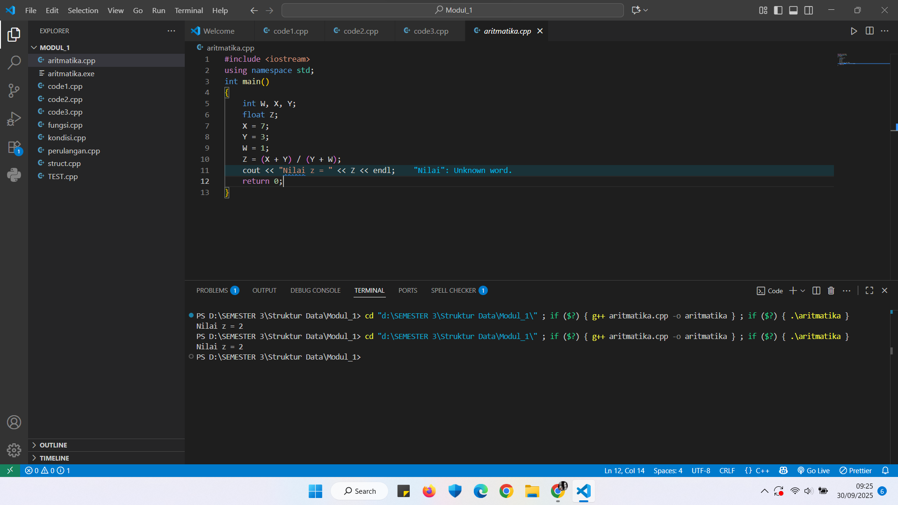
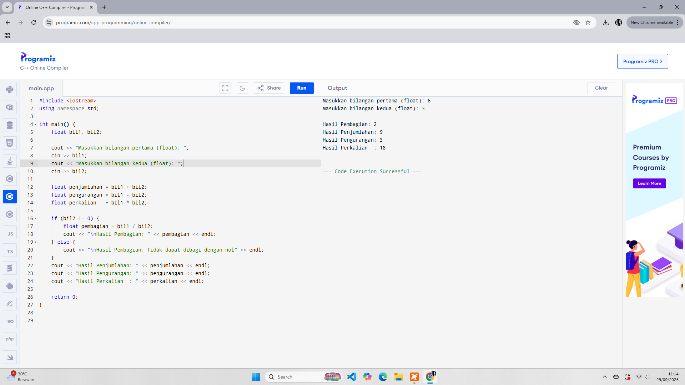
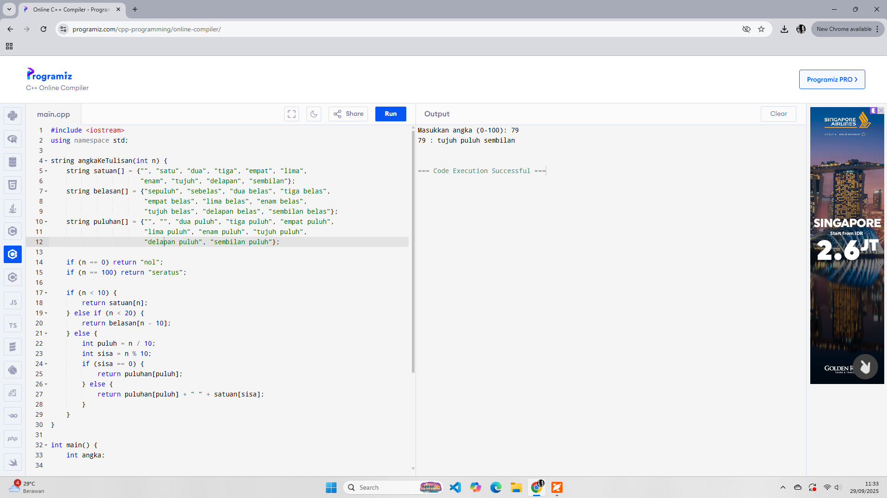
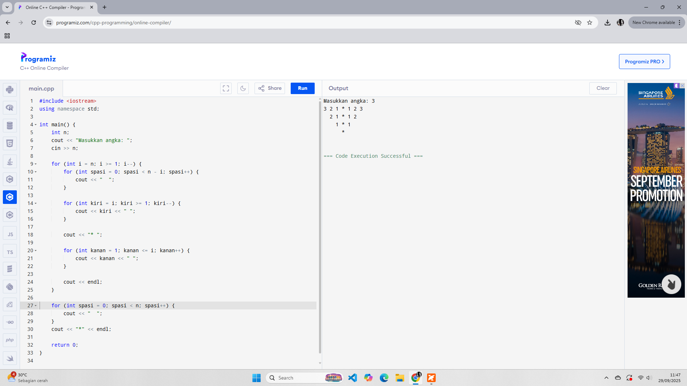

# <h1 align="center">Laporan Praktikum Modul 1 <br> Pengenalan CPP</h1>
<p align="center">Zulfan Hanif - 103112430221</p>

## Dasar Teori

Bahasa C++ diciptakan oleh Bjarne Stroustrup di AT&T Bell Laboratories awal tahun 1980-an berdasarkan C ANSI(American National Standart Institute). Prototype C++ muncul sebagai C yang dipercanggih dengan fasilitas kelas. Setelah itu tahun 1983-1984, C dengan kelas disempurnakan dengan menambahkan fasilitas pembeban lebihan operator dan fungsi yang kemudian melahirkan apa yang disebut C++. Simbol ++ merupakan operator C untuk operasi penaikan, muncul untuk menunjukan bahwa bahasa baru ini merupakan versi yang lebih canggih dari C. 

1. Pengenal
   
   Indentifier merupakan nama yang biasa digunakan untuk variabel, konstanta, fungsi atau objek lain yang didefinisikan oleh program. Aturan yang digunakan untuk menentukan identifier:
   - Harus diawali dengan huruf(A....Z, a.....z) atau garis bawah(_).
   - Karakter selanjutnya bisa berupa huruf, digit atau karakter garis bawah (_) atau dollar($).
   - Panjang maksimal identifier adalah 32 karakter; jika lebih, hanya 32 karakter awal yang dianggap.
   - Tidak boleh mengandung spasi.
   - Tidak boleh menggunakan operator aritmatika (+-/*%).
   - Bahasa C++ bersifat
     case sensitive, artinya huruf besar dan huruf kecil dianggap berbeda (Contoh: panjang berbeda dengan Panjang).
3. Tipe Data Dasar
   
   Data adalah suatu nilai yang dapat dinyatakan dalam bentuk konstanta atau variabel. Data berdasarkan jenisnya dibagi menjadi 5 kelompok, yang disebut tipe data dasar:
   - Bilangan bulat (integer).
   - Bilangan real presisi - tunggal.
   - Bilangan real presisi - ganda.
   - Karakter.
   - Tak-bertipe.
   
> Daftar tipe data dasar:
> 
> 

3. Pemodifikasi Tipe (Type Modifier):
   - unsigned: Digunakan untuk data dengan nilai positif saja (misalnya, unsigned int dapat menerima data dari 0-65.535).
   - short: Digunakan bersama integer yang ukurannya disamakan dengan integer atau dibedakan, tergantung pada sistem dan jenis komputer.
   - long: Digunakan untuk menaikkan kapasitas dari suatu variabel.

4. Variabel dan Konstanta
   
   - Variabel

     Variabel digunakan untuk menyimpan nilai, dan nilainya bisa berubah-ubah selama program berjalan. Aturan penamaan variabel harus sesuai dengan aturan penamaan identifier. Bentuk umum pendeklarasian: tipe_data nama_variabel;.

> Contoh: 

> *int x,y;*

Variabel dapat langsung diberikan nilai awal (inisialisasi) saat dideklarasikan.
    
    Contoh: 
    
    *int x=20, Y=6;*

   - Konstanta

     Konstanta menyatakan nilai yang selalu tetap dan juga mempunyai tipe data. Pendeklarasian konstanta dilakukan dengan menambahkan kata kunci const di depan tipe data dan variabel.

     Contoh:

     *const float phi = 3.14;*

5. Output: Fungsi cout()

*cout()* digunakan untuk mencetak data baik yang bertipe numerik, teks, konstanta, maupun variabel. Penentu format (%d, %f, dll.) dipakai di bahasa C, tetapi tidak harus dipakai pada C++. Untuk mengatur lebar field dan jumlah desimal yang ingin dicetak pada tipe data float, digunakan format %a.bf (di mana a adalah Lebar Field dan b adalah Jumlah Desimal).


- Escape Sequence

Notasi 

\ dianggap sebagai karakter "escape".

Contoh:

\n: Baris baru (Newline).

\t: Tabulasi.

\": Tanda kutip ganda.

6. Input: Fungsi cin() dan getchar()

- Fungsi cin() digunakan untuk meminta inputan keyboard dari user.

Bentuk umum: *cin >> nama_variabel;*

Pada cin(), tidak perlu menggunakan penentu format seperti pada printf(). cin menggunakan operator >> untuk langsung memasukkan nilai ke dalam variabel.


- Fungsi getchar() digunakan untuk membaca satu karakter dari input standar (keyboard).

getchar() akan menunggu pengguna menekan sebuah tombol dan tidak memerlukan tombol Enter untuk menyelesaikan input, berbeda dengan cin.

7. Operator Aritmatika

Operator Aritmatika digunakan untuk operasi matematika dasar. Tingkatan pengerjaan operator diatur berdasarkan aturan tanda kurung (), perkalian/pembagian/sisa pembagian (*, /, %), dan penambahan/pengurangan (+, -).

Contoh Operator Aritmatika Lain (Operator Pengerjaan Aritmatika/Assignment):

- +=: assignment penambahan (Contoh: A += 7 ekuivalen dengan A = A + 7).
- -= : assignment pengurangan.
- *= : assignment perkalian.
- /= : assignment pembagian.
- %=: assignment mod.

8. Kondisional

Kondisional (Percabangan) digunakan untuk mengatasi masalah yang memerlukan pengambilan keputusan.

- Pernyataan if

  Melaksanakan pernyataan jika kondisi benar.

  Bentuk 1:

```cpp
C++

if (kondisi)
{
    pernyataan;
}
Jika kondisi benar, maka pernyataan dijalankan.
```

- Pernyataan if-else

  Menyediakan dua pilihan pernyataan yang akan dijalankan.

  Bentuk 2:

```cpp
C++

if (kondisi)
    pernyataan1;
else
    pernyataan2;
Jika kondisi benar, maka pernyataan1 dijalankan. Jika kondisi salah, maka pernyataan2 yang dijalankan.
```

- Pernyataan switch

  Digunakan untuk menangani pengambilan keputusan yang melibatkan banyak alternatif.

  Bentuk 3:

```cpp
C++

switch (variabel) {
    case kondisi1: pernyataan1; break;
    case kondisi2: pernyataan2; break;
    default: pernyataan_n; break;
}
Pilihan pada switch akan dimulai dari kondisi1, kalau nilai kondisi1 cocok maka pernyataan1 dilakukan, bila tidak cocok akan diteruskan pada pengecekan pernyataan2. Bila tidak ditemukan kondisi yang cocok maka default akan dijalankan.
```

9. Perulangan

   Perulangan (Looping) digunakan untuk mengeksekusi satu atau serangkaian perintah secara berulang-ulang.

   - Perulangan for dan while

     Digunakan jika sudah dapat dipastikan kondisi perulangan akan terpenuhi.
     
   - Perulangan for:
  
```cpp
C++

for (initialization; condition; increment/decrement)
    statement;
initialization: Pernyataan untuk menyatakan keadaan awal dari variabel kontrol.

condition: Ekspresi relasi yang menyatakan kondisi untuk keluar dari perulangan.

increment/decrement: Pengaturan perubahan nilai variabel kontrol.
```

   - Perulangan while:

```cpp
C++

while (condition) {
    statement;
    increment/decrement;
}
```
     
   - Perulangan do...while

     Digunakan jika seleksi berada di bawah batas perulangan.

     Struktur:

```cpp
C++

do {
    statement;
} while (condition);
Perintah di dalam do...while akan dieksekusi minimal satu kali sebelum kondisi diperiksa.
```

10. Struktur (Struct)

    Struktur merupakan tipe data bentukan berupa kumpulan dari variabel yang dinyatakan dalam sebuah nama, di mana setiap variabel bisa memiliki tipe yang berlainan. Struktur digunakan untuk mengelompokkan beberapa informasi yang saling berkaitan menjadi satu kesatuan (dalam bahasa Pascal disebut record).

Bentuk umum pendeklarasian struktur:

```cpp
C++

struct nama_tipe_struktur {
    tipe field1;
    tipe field2;
    ...
    tipe fieldN;
} variabel_struktur1, ... variabel_strukturN;
Mengakses elemen struktur menggunakan tanda dot (.) atau titik dua (:).

Contoh: variabel_struktur.nama_field.
```

## Guided

### Soal 1

aku mengerjakan perulangan

```cpp
#include <iostream>
using namespace std;
int main()
{
    string ch;
    cout << "Masukkan sebuah karakter: ";
    // cin >> ch;
    ch = getchar();  //Menggunakan getchar() untuk membaca satu karakter
    cout << "Karakter yang Anda masukkan adalah: " << ch << endl;
    return 0;
}
```
> Output
> 


### Soal 2

aku mengerjakan perulangan

```cpp
#include <iostream>
using namespace std;
int main()
{
    int W, X, Y;
    float Z;
    X = 7;
    Y = 3;
    W = 1;
    Z = (X + Y) / (Y + W);
    cout << "Nilai z = " << Z << endl;
    return 0;
}
```
> Output
> 

### Soal 3

aku mengerjakan perulangan

```cpp
#include <iostream>
using namespace std;

// Prosedur: hanya menampilkan hasil, tidak mengembalikan nilai
void tampilkanHasil(double p, double l)
{
    cout << "\n=== Hasil Perhitungan ===" << endl;
    cout << "Panjang : " << p << endl;
    cout << "Lebar   : " << l << endl;
    cout << "Luas    : " << p * l << endl;
    cout << "Keliling: " << 2 * (p + l) << endl;
}

// Fungsi: mengembalikan nilai luas
double hitungLuas(double p, double l)
{
    return p * l;
}

// Fungsi: mengembalikan nilai keliling
double hitungKeliling(double p, double l)
{
    return 2 * (p + l);
}

int main()
{
    double panjang, lebar;

    cout << "Masukkan panjang: ";
    cin >> panjang;
    cout << "Masukkan lebar  : ";
    cin >> lebar;

    // Panggil fungsi
    double luas = hitungLuas(panjang, lebar);
    double keliling = hitungKeliling(panjang, lebar);

    cout << "\nDihitung dengan fungsi:" << endl;
    cout << "Luas      = " << luas << endl;
    cout << "Keliling  = " << keliling << endl;

    // Panggil prosedur
    tampilkanHasil(panjang, lebar);

    return 0;
}
```

> Output
> 


### Soal 4

aku mengerjakan perulangan

```cpp
#include <iostream>
using namespace std;
// int main()
// {
//     double tot_pembelian, diskon;
//     cout << "total pembelian: Rp";
//     cin >> tot_pembelian;
//     diskon = 0;
//     if (tot_pembelian >= 100000)
//         diskon = 0.05 * tot_pembelian;
//     cout << "besar diskon = Rp" << diskon;
// }


// int main()
// {
//     double tot_pembelian, diskon;
//     cout << "total pembelian: Rp";
//     cin >> tot_pembelian;
//     diskon = 0;
//     if (tot_pembelian >= 100000)
//         diskon = 0.05 * tot_pembelian;
//     else
//         diskon = 0;
//     cout << "besar diskon = Rp" << diskon;
// }


int main()
{
    int kode_hari;
    cout << "Menentukan hari kerja/libur\n"<<endl;
    cout << "1=Senin 3=Rabu 5=Jumat 7=Minggu "<<endl;
    cout << "2=Selasa 4=Kamis 6=Sabtu "<<endl;
    cin >> kode_hari;
    switch (kode_hari)
    {
    case 1:
    case 2:
    case 3:
    case 4:
    case 5:
        cout<<"Hari Kerja";
        break;
    case 6:
    case 7:
        cout<<"Hari Libur";
        break;
    default:
        cout<<"Kode masukan salah!!!";
    }
    return 0;
}
```

> Output
> 

### Soal 5

aku mengerjakan perulangan

```cpp
#include <iostream>
using namespace std;
// int main()
// {
//     int jum;
//     cout << "jumlah perulangan: ";
//     cin >> jum;
//     for (int i = 0; i < jum; i++)
//     {
//         cout << "saya sahroni\n";
//     }
//     return 1;
// }


// while
int main()
{
    int i = 1;
    int jum;
    cin >> jum;
    do
    {
        cout << "bahlil ke-" << (i + 1) << endl;
        i++;
    } while (i < jum);
    return 0;
}
```

> Output
> 

### Soal 6

aku mengerjakan perulangan

```cpp
#include <iostream>
#include <string>
using namespace std;

// Definisi struct
struct Mahasiswa {
    string nama;
    string nim;
    float ipk;
};

int main() {

    Mahasiswa mhs1;

    cout << "Masukkan Nama Mahasiswa: ";
    getline(cin, mhs1.nama);
    // cin >> mhs1.nama;
    cout << "Masukkan NIM Mahasiswa : ";
    cin >> mhs1.nim;
    cout << "Masukkan IPK Mahasiswa : ";
    cin >> mhs1.ipk;

    cout << "\n=== Data Mahasiswa ===" << endl;
    cout << "Nama : " << mhs1.nama << endl;
    cout << "NIM  : " << mhs1.nim << endl;
    cout << "IPK  : " << mhs1.ipk << endl;

    return 0;
}

```

> Output
> 

## Unguided

### Soal 1

Buatlah program yang menerima inputan dua buah bilangan betipe float, kemudian memberikan outputan hasil penjumlahan, pengurangan, perkalian, dan pembagian dari dua bilangan tersebut.

```cpp
#include <iostream> 
using namespace std;

int main() {
    float bil1, bil2;

    cout << "Masukkan bilangan pertama (float): ";
    cin >> bil1;
    cout << "Masukkan bilangan kedua (float): ";
    cin >> bil2;

    float penjumlahan = bil1 + bil2;
    float pengurangan = bil1 - bil2;
    float perkalian   = bil1 * bil2;

    if (bil2 != 0) {
        float pembagian = bil1 / bil2;
        cout << "\nHasil Pembagian: " << pembagian << endl;
    } else {
        cout << "\nHasil Pembagian: Tidak dapat dibagi dengan nol" << endl;
    }
    cout << "Hasil Penjumlahan: " << penjumlahan << endl;
    cout << "Hasil Pengurangan: " << pengurangan << endl;
    cout << "Hasil Perkalian  : " << perkalian << endl;

    return 0; 
}
```

> Output
> 

> Penjelasan

Tujuan dari program ini adalah untuk menerima input berupa dua bilangan bertipe float dari pengguna, kemudian melakukan perhitungan aritmatika dasar terhadap kedua bilangan tersebut. Operasi yang dilakukan yaitu penjumlahan dari kedua bilangan, pengurangan antara bilangan pertama dan kedua, perkalian dari kedua bilangan, pembagian antara bilangan pertama dan kedua dengan pengecekan agar tidak terjadi pembagian dengan nol. Hasil dari setiap operasi tersebut kemudian ditampilkan ke layar sebagai output.

1. Menggunakan library <iostream>

Library tersebut digunakan untuk melakukan proses input (cin) dan output (cout) pada program.

2. *using namespace std;*

Berguna supaya kita tidak perlu menulis std::cout atau std::cin, cukup cout dan cin saja.

3. Deklarasi Variabel
   
Mendeklarasikan variabel

*float bil1, bil2;*

Kedua variabel ini bertipe float karena di dalam soal meminta bilangan dengan koma/desimal.

4. Proses input dari pengguna

*cout << "Masukkan bilangan pertama (float): ";*

*cin >> bil1;*

*cout << "Masukkan bilangan kedua (float): ";*

*cin >> bil2;*

untuk meminta pengguna memasukkan dua angka bertipe float dan menyimpannya dalam variabel bil1 & bil2.

5. Operasi Aritmatika

- penjumlahan = bil1 + bil2;

- pengurangan = bil1 - bil2;

- perkalian = bil1 * bil2;

- pembagian = bil1 / bil2; (dengan syarat bil2 != 0 agar tidak error).

6. Cek Pembagian dengan Nol
Jika bil2 bernilai 0, maka program akan menampilkan pesan bahwa pembagian tidak bisa dilakukan.

7. Output
Hasil ditampilkan menggunakan cout secara berurutan dari penjumlahan, pengurangan, perkalian, dan pembagian.

### Soal 2

Buatlah sebuah progam yang menerima masukan angka dan mengeluarkan output nilai angka tersebut dalam bentuk tulisan. Angka yang akan di input kan user adalah bilangan bulat positif mulai dari 0 s.d 100.
> Contoh: 79: tujuh puluh sembilan

```cpp
#include <iostream>
using namespace std;

string angkaKeTulisan(int n) {
    string satuan[] = {"", "satu", "dua", "tiga", "empat", "lima",
                       "enam", "tujuh", "delapan", "sembilan"};
    string belasan[] = {"sepuluh", "sebelas", "dua belas", "tiga belas",
                        "empat belas", "lima belas", "enam belas",
                        "tujuh belas", "delapan belas", "sembilan belas"};
    string puluhan[] = {"", "", "dua puluh", "tiga puluh", "empat puluh",
                        "lima puluh", "enam puluh", "tujuh puluh",
                        "delapan puluh", "sembilan puluh"};

    if (n == 0) return "nol";
    if (n == 100) return "seratus";

    if (n < 10) {
        return satuan[n];
    } else if (n < 20) {
        return belasan[n - 10];
    } else {
        int puluh = n / 10;
        int sisa = n % 10;
        if (sisa == 0) {
            return puluhan[puluh];
        } else {
            return puluhan[puluh] + " " + satuan[sisa];
        }
    }
}

int main() {
    int angka;

    cout << "Masukkan angka (0-100): ";
    cin >> angka;

    if (angka < 0 || angka > 100) {
        cout << "Angka di luar jangkauan cuy!" << endl;
    } else {
        cout << angka << " : " << angkaKeTulisan(angka) << endl;
    }

    return 0;
}


```

> Output
> 

> Penjelasan

Tujuan dari program ini adalah untuk menerima input berupa bilangan bulat positif antara 0 hingga 100, kemudian mengeluarkan output berupa representasi angka tersebut dalam bentuk tulisan. Nantinya pengguna dapat memasukkan angka dalam bentuk numerik, setelah itu program akan mengubah angka tersebut ke bentuk tulisan penulisan angka dalam bahasa Indonesia dan hasil konversi ditampilkan di layar.

Contoh hasil: 79 : tujuh puluh sembilan

Dengan demikian, program ini mempermudah proses konversi angka ke tulisan tanpa harus dilakukan secara manual, sekaligus melatih pemahaman struktur kondisi dan penggunaan array dalam bahasa pemrograman C++.

1. *Array String satuan[], belasan[], dan puluhan[]*

satuan digunakan untuk angka 1–9.

belasan untuk angka 10–19.

puluhan untuk angka 20, 30, … sampai 90.

2. Kasus Khusus (Boundary Case)

Jika n == 0 → output "nol".

Jika n == 100 → output "seratus".

3. Jika Angka < 10
   
Misalnya 7 → "tujuh".

5. Jika Angka 10–19
   
Misalnya 13 → "tiga belas".

7. Jika Angka 20–99

puluh = n / 10 → mengambil bagian puluhan.

sisa = n % 10 → mengambil bagian satuan.

Jika sisa == 0 → angka bulat puluhan, misalnya 40 → "empat puluh".

Jika sisa != 0 → gabungan puluhan + satuan, misalnya 79 → "tujuh puluh sembilan".

6. Validasi Input
   
Jika pengguna memasukan angka di luar rentang 0–100, maka program akan menolak dengan mengeluarkan Angka diluar jangkauan cuy!.

### Soal 3

Buatlah program yang dapat memberikan input dan ouput sbb.




```cpp
#include <iostream>
using namespace std;

int main() {
    int n;
    cout << "Masukkan angka: ";
    cin >> n;

    for (int i = n; i >= 1; i--) {
        for (int spasi = 0; spasi < n - i; spasi++) {
            cout << "  ";
        }

        for (int kiri = i; kiri >= 1; kiri--) {
            cout << kiri << " ";
        }

        cout << "* ";

        for (int kanan = 1; kanan <= i; kanan++) {
            cout << kanan << " ";
        }

        cout << endl;
    }

    for (int spasi = 0; spasi < n; spasi++) {
        cout << "  ";
    }
    cout << "*" << endl;

    return 0;
}
```

> Output
> 

> Penjelasan

Tujuan dari program ini adalah untuk membuat sebuah aplikasi sederhana yang menerima input berupa bilangan bulat positif kemudian menampilkan pola(pattern) berbentuk seperti cermin sesuai dengan angka yang dimasukkan. Dengan alur pengguna memasukan angka positif, setelah program akan mencetak pola seperti cermin mengerucut kebawah, baris angka kebawah nya sebanyak angka yang dimasukan pengguna.  

1. Proses input angka n
_cout << "Masukkan angka: ";
cin >> n;_

Program akan meminta angka dari pengguna (misalnya n = 3) dan memasukan angka tersebut kedalam variabel n.

2. Loop Baris

Program mencetak dari i = n sampai i = 1. Nantinya jumlah baris utama ada n dan setelah selesai, ada baris tambahan * di paling bawah.

3. Spasi di Awal

*for (int spasi = 0; spasi < n - i; spasi++) cout << "  ";*

Supaya angka bergeser ke kanan, membentuk pola mirroring.

4. Bagian Kiri (Menurun)

*for (int kiri = i; kiri >= 1; kiri--) cout << kiri << " ";*

Menampilkan angka dari i sampai 1.

5. Tanda Bintang *

*cout << "* ";*

Selalu ada di tengah tiap baris.

6. Bagian Kanan (Menaik)

*for (int kanan = 1; kanan <= i; kanan++) cout << kanan << " ";*

Menampilkan angka dari 1 ke i.

7. Baris Terakhir

Setelah proses loop selesai, baris terakhir hanya berisi spasi dan tanda *.

## Referensi

1. https://www.w3schools.com/cpp/default.asp 

