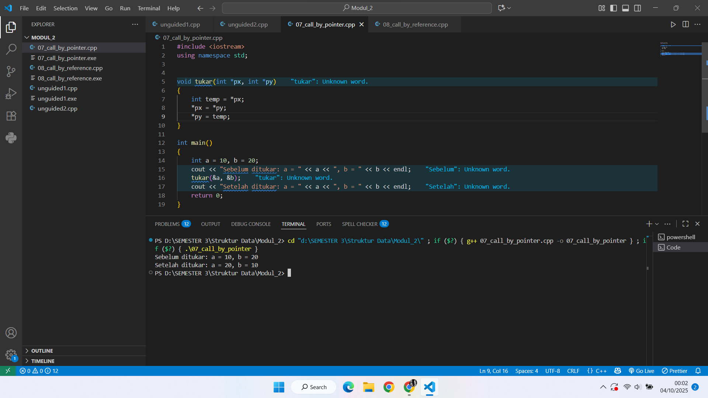
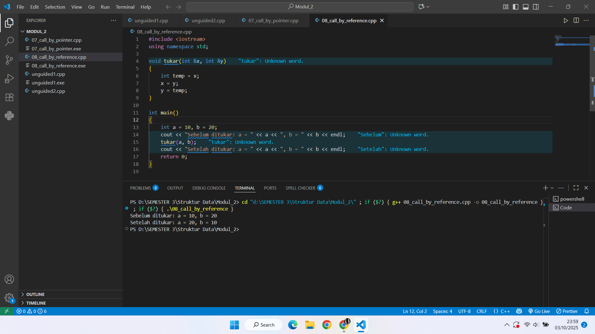
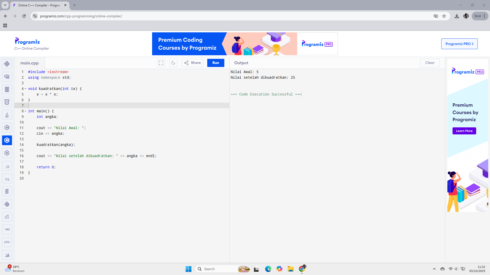

# <h1 align="center">Laporan Praktikum Modul 2 <br> Pengenalan CPP Part 2</h1>
<p align="center">ZULFAN HANIF IHSANI - 103112430221</p>

## Dasar Teori

Pada pertemuan dua ini, melanjutkan dari apa yang udah 

#### 1. Konsep Array
   
Array atau Larik adalah tipe data terstruktur yang berfungsi sebagai wadah untuk menyimpan sekelompok data yang memiliki tipe data yang sama (homogen) di bawah satu nama variabel. Array memiliki sifat statis, yang berarti ukuran (jumlah elemen) dari array harus ditentukan saat deklarasi dan tidak dapat diubah selama program berjalan. Setiap elemen dalam array diakses melalui indeks yang bersifat unik. Dalam bahasa C++, indeks array selalu dimulai dari 0.

##### A. Array Satu Dimensi (1D)

Array satu dimensi adalah larik data sederhana yang hanya memerlukan satu indeks untuk mengakses elemennya.
```
Deklarasi: 
tipe_data nama_array[ukuran];
```
```
Contoh:
int nilai[10]; (membuat array bernama nilai yang dapat menyimpan 10 nilai integer, dari nilai[0] hingga nilai[9]).
```

##### B. Array Dua Dimensi (2D)

Array dua dimensi menyerupai tabel atau matriks, di mana data diorganisir dalam baris dan kolom. Diperlukan dua indeks untuk mengakses setiap elemen.

```
Deklarasi: tipe_data nama_array[baris][kolom];
```
```
Contoh: float matriks[3][4]; (membuat array matriks berukuran 3 baris dan 4 kolom). 
```

#### 2. Parameter Fungsi dan Mekanisme Pelewatan
   
Fungsi atau Prosedur (dikenal sebagai fungsi void di C++) adalah subprogram yang menerima nilai melalui parameter. Cara data dilewatkan dari program pemanggil (parameter aktual) ke subprogram (parameter formal) dikenal sebagai mekanisme pelewatan parameter.

##### A. Call by Value (Pelewatan Nilai)

Mekanisme ini adalah standar C++. Nilai dari parameter aktual disalin (di-copy) ke parameter formal.

Efek: Parameter formal dan aktual adalah dua variabel yang terpisah. Setiap perubahan yang dilakukan pada parameter formal di dalam fungsi tidak akan memengaruhi nilai parameter aktual di luar fungsi.

##### B. Call by Reference (Pelewatan Acuan)

Call by Reference adalah mekanisme pelewatan yang memungkinkan fungsi untuk memodifikasi variabel asli dari program pemanggil.

Mekanisme: Yang dilewatkan adalah alamat memori dari variabel aktual. Parameter formal menjadi alias (nama lain) bagi variabel aktual, sehingga keduanya menunjuk ke lokasi memori yang sama.

Implementasi: Parameter formal dideklarasikan dengan menambahkan operator ampersand (&) setelah tipe data.

```cpp
void tukar(int &a, int &b) { // 'a' dan 'b' adalah referensi
    // ... perubahan pada a dan b akan mempengaruhi variabel aslinya
}
```

Efek: Perubahan pada parameter formal di dalam fungsi secara langsung memengaruhi nilai variabel aktual di program pemanggil.

##### C. Call by Pointer (Pelewatan Alamat)

Call by Pointer adalah mekanisme pelewatan yang menggunakan variabel pointer untuk secara eksplisit menunjuk alamat memori variabel aktual.

Mekanisme: Program pemanggil mengirimkan alamat memori (&nama_variabel) dari variabel aktual. Parameter formal dideklarasikan sebagai variabel pointer (*nama_pointer) untuk menyimpan alamat tersebut.

Konsep Pointer:

- Pointer (*) adalah variabel yang menyimpan alamat memori.

- Operator & (Address-of) digunakan untuk mendapatkan alamat variabel.

- Operator * (Dereference) digunakan untuk mengakses atau memanipulasi nilai yang berada di alamat yang ditunjuk oleh pointer.

Implementasi:

```cpp
void tukar(int *a, int *b) { // 'a' dan 'b' adalah pointer
    int temp = *a; // Ambil nilai yang ditunjuk 'a'
    *a = *b;       // Ubah nilai di alamat 'a'
    *b = temp;     // Ubah nilai di alamat 'b'
}
// Pemanggilan: tukar(&nilai1, &nilai2);
```

Efek: Fungsi dapat memanipulasi nilai variabel aktual dengan menggunakan operator dereference (*) pada pointer formal, karena mereka bekerja pada lokasi memori yang sama.

Call by Reference dan Call by Pointer adalah cara utama untuk memungkinkan fungsi mengubah nilai variabel di program pemanggil, yang sangat penting dalam pengolahan array besar atau struktur data lainnya karena menghindari penyalinan data yang tidak efisien.


## Guided

### Soal 1

Aku mengerjakan sebuah program dalam bahasa C++ yang memanfaatkan konsep call by reference menggunakan pointer. Program ini berfungsi untuk menukar nilai dari dua variabel, yaitu a dan b, dengan bantuan sebuah prosedur bernama tukar. 

Tujuan dari program ini adalah:
1. Menunjukkan bagaimana penggunaan pointer dalam C++.
2. Mempraktikkan call by reference, di mana variabel asli yang dikirimkan ke fungsi bisa langsung berubah nilainya tanpa perlu mengembalikan nilai.
3. Membuktikan perbedaan nilai variabel sebelum dan sesudah proses pertukaran dengan memanggil fungsi tukar.

```cpp
#include <iostream>
using namespace std;


void tukar(int *px, int *py)
{
    int temp = *px;
    *px = *py;
    *py = temp;
}

int main()
{
    int a = 10, b = 20;
    cout << "Sebelum ditukar: a = " << a << ", b = " << b << endl;
    tukar(&a, &b);
    cout << "Setelah ditukar: a = " << a << ", b = " << b << endl;
    return 0;
}
```

> Output
> 


### Soal 2

aku mengerjakan perulangan

```cpp
#include <iostream>
using namespace std;

void tukar(int &x, int &y)
{
    int temp = x;
    x = y;
    y = temp;
}

int main()
{
    int a = 10, b = 20;
    cout << "Sebelum ditukar: a = " << a << ", b = " << b << endl;
    tukar(a, b);
    cout << "Setelah ditukar: a = " << a << ", b = " << b << endl;
    return 0;
}
```

> Output
> 

## Unguided

### Soal 1

Buatlah sebuah program untuk melakukan transpose pada sebuah matriks persegi berukuran 3x3. Operasi transpose adalah mengubah baris menjadi kolom dan sebaliknya. Inisialisasi matriks awal di dalam kode, kemudian buat logika untuk melakukan transpose dan simpan hasilnya ke dalam matriks baru. Terakhir, tampilkan matriks awal dan matriks hasil transpose. 

Contoh Output: 

```
Matriks awal :

1 2 3
4 5 6
7 8 9 

Matriks hasil transpose:

1 4 7
2 5 8
3 6 9
```

```cpp
#include <iostream>
using namespace std;

int main() {
    int matriks[3][3] = {
        {1, 2, 3},
        {4, 5, 6},
        {7, 8, 9}
    };

    int transpose[3][3];

    for (int i = 0; i < 3; i++) {
        for (int j = 0; j < 3; j++) {
            transpose[j][i] = matriks[i][j];
        }
    }

    cout << "Matriks awal :" << endl;
    for (int i = 0; i < 3; i++) {
        for (int j = 0; j < 3; j++) {
            cout << matriks[i][j] << " ";
        }
        cout << endl;
    }

    cout << endl;

    cout << "Matriks hasil transpose :" << endl;
    for (int i = 0; i < 3; i++) {
        for (int j = 0; j < 3; j++) {
            cout << transpose[i][j] << " ";
        }
        cout << endl;
    }

    return 0;
}

```

> Output
> 

1. Inisialisasi Matriks
   
```cpp
int matriks[3][3] = {
    {1, 2, 3},
    {4, 5, 6},
    {7, 8, 9}
};
```

Sesuai dengan soal, bahwa matriks awal di inisialisasi didalam kode, maka matriks awal ditentukan langsung di dalam kode program. Isinya adalah angka 1–9 dalam bentuk 3 baris dan 3 kolom.

2. Membuat Matriks Transpose
   
```cpp
int transpose[3][3];
```

Setelah itu menyediakan array 2 dimensi kosong untuk menyimpan hasil transpose.

### Soal 2

Buatlah program yang menunjukan penggunaan call by reference. Buat sebuah prosedur bernama kuadratkan yang menerima satu parameter integer secara referensi(&). Prosedur ini akan mengubah nilai asli variabel yang dilewatkan dengan nilai kuadratnya. Tampilkan nilai variabel di main() sebelum dan sesudah memanggil prosedur untuk membuktikan perubahannya.

Contoh Output:

```
Nilai awal: 5
Nilai setelah dikuadratkan: 25
```

```cpp
#include <iostream>
using namespace std;

void kuadratkan(int &x) {
    x = x * x;  
}

int main() {
    int angka;

    cout << "Nilai Awal: ";
    cin >> angka;

    kuadratkan(angka);

    cout << "Nilai setelah dikuadratkan: " << angka << endl;

    return 0;
}
```

> Output
> 

> Penjelasan

1. Prosedur kuadratkan

```cpp
void kuadratkan(int &x) {
    x = x * x;
}
```

Prosedur ini menerima parameter dengan tanda & yang artinya adalah call by reference. Call by reference berarti prosedur tidak membuat salinan variabel baru, tetapi langsung mengacu ke alamat memori variabel asli.

Pada code operasi _x = x * x;_ code akan langsung mengubah nilai asli variabel yang dipanggil di main().

2. Fungsi main()

```cpp
int angka;
cout << "Masukkan sebuah bilangan: ";
cin >> angka;
```

   Di dalam fungsi main(), pertama program akan mengeluarakan perintah kepada user menggunakan fungsi cout, setelah itu user memasukkan sebuah bilangan bulat ke variabel angka.

```cpp
kuadratkan(angka);
```

Setelah user melakukan input, program masuk ke pemanggilan prosedur menggunakan call by reference. Variabel angka langsung berubah nilainya menjadi kuadrat dari bilangan semula.

```cpp
cout << "Nilai setelah dipanggil prosedur kuadratkan: " << angka << endl;
```

Setelah proses prosedur telah selesai, program menampilkan nilai angka, dimana angka sudah berubah menjadi kuadrat.

## Referensi

1. https://en.wikipedia.org/wiki/Data_structure
2. https://www.w3schools.com/cpp/cpp_arrays.asp

