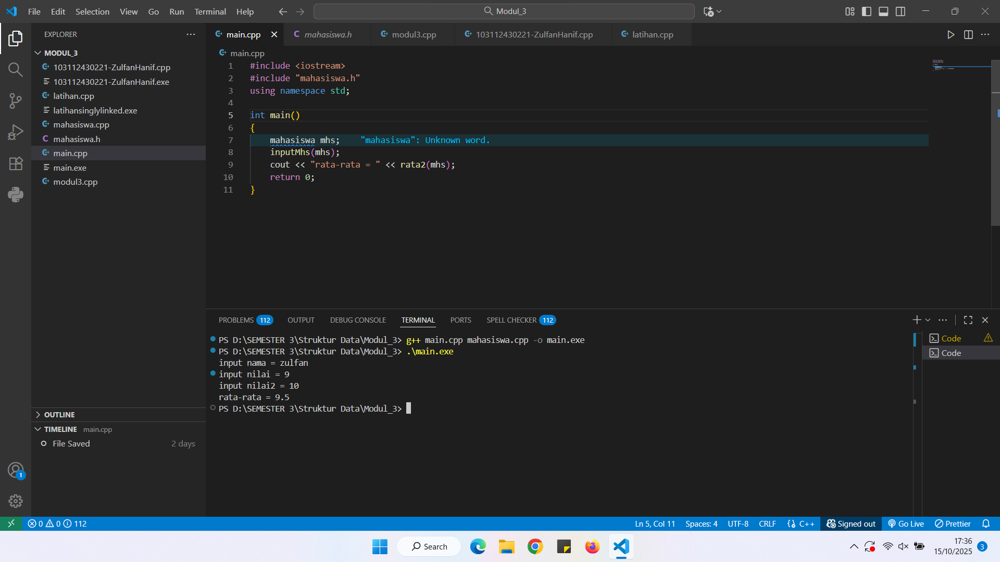
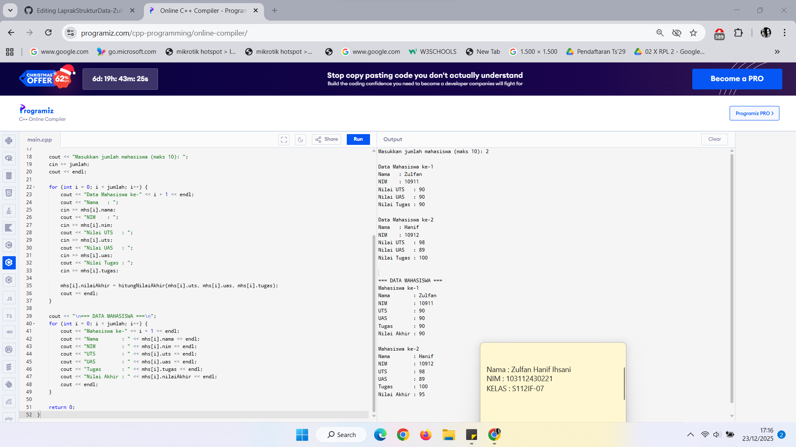
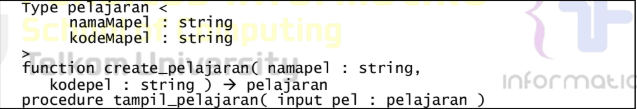
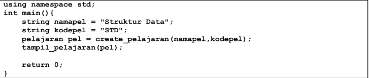
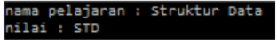
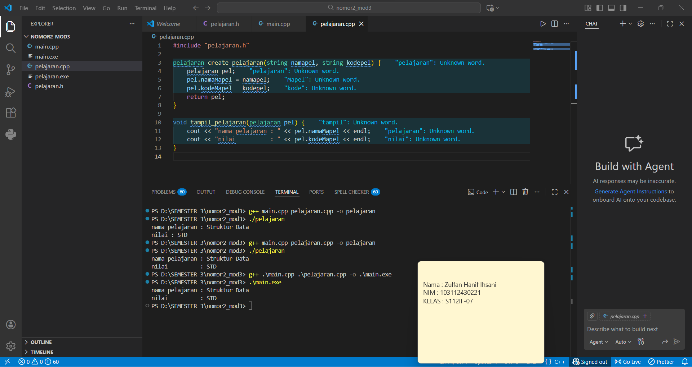

# <h1 align="center">Laporan Praktikum Modul 3 <br> ABSTRACT DATA TYPE</h1>
<p align="center">ZULFAN HANIF IHSANI - 103112430221</p>

## Dasar Teori

ABSTRACT DATA TYPE(ADT)

ADT adalah TYPE dan sekumpulan PRIMITIF (operasi dasar) terhadap TYPE tersebut. Selain itu, dalam sebuah ADT yang lengkap, disertakan pula definisi invarian dari TYPE dan aksioma yang berlaku. ADT merupakan definisi STATIK.

ADT biasanya diimplementasikan menjadi dua buah modul utama dan 1 modul interface program utama (driver). Dua modul tersebut adalah sebagai berikut:

1. Definisi/Spesifikasi Type dan Primitif/Header fungsi (.h)
   - Spesifikasi type sesuai dengan kaidah bahasa yang dipakai
   - Spesifikasi dari primitif sesuai dengan kaidah dalam konteks prosedural,yaitu:
   - Fungsi : nama, domain, range, dan prekondisi jika ada
   - Prosedur : Initial state, Final state, dan proses yang dilakukan
     
2. Body/realisasi dari primitif (.c)

   Berupa kode program dalam bahasa yang bersangkutan (dalam praktikum ini berarti dengan bahasa C++). Realisasi fungsi dan prosedur harus sedapat mungkin memanfaatkan selector dan konstruktor. Untuk memahami lebih jelas mengenai konsep ADT, perhatikan ilustrasi berikut

Untuk menerapkan konsep ADT, kita harus memisah deklarasi tipe, variabel, dan fungsi dari program ke dalam sebuah file.h dan memisah definisi fungsi dari program ke sebuah file.cpp. Sehingga jika kita menerapkan konsep ADT berdasarkan contoh program di atas, bentuk code program akan dipisah menjadi seperti berikut. 

## Guided

### Soal 1

> Output
> 

> Mahasiswa.h
```cpp
#ifndef MAHASISWA_H_INCLUDED
#define MAHASISWA_H_INCLUDED
struct mahasiswa{
    char nim[10];
    int nilai1, nilai2;
};
void inputMhs(mahasiswa &m);
float rata2(mahasiswa m);
#endif // MAHASISWA_H_INCLUDED
```

> Mahasiswa.cpp
```cpp
#include "mahasiswa.h"
#include <iostream>
using namespace std;

void inputMhs(mahasiswa &m){
    cout << "input nama = ";
    cin >> (m).nim;
    cout << "input nilai1 = ";
    cin >> (m).nilai1;
    cout << "input nilai2 = ";
    cin >> (m).nilai2;
}

float rata2(mahasiswa m){
    return (m.nilai1 + m.nilai2) / 2;
}
```

> Main.cpp
```cpp
#include <iostream>
#include "mahasiswa.h"
using namespace std;

int main()
{
    mahasiswa mhs;
    inputMhs(mhs);
    cout << "rata - rata = " << rata2(mhs) << endl;
    return 0;
}
```
## Unguided

### Soal 1

Buat program yang dapat menyimpan data mahasiswa (max. 10) ke dalam sebuah array dengan field nama, nim, uts, uas, tugas, dan nilai akhir. Nilai akhir diperoleh dari FUNGSI dengan rumus 0.3*uts+0.4*uas+0.3*tugas.

```cpp
#include <iostream>
using namespace std;

struct Mahasiswa {
    string nama;
    string nim;
    float uts, uas, tugas, nilaiAkhir;
};

float hitungNilaiAkhir(float uts, float uas, float tugas) {
    return (0.3 * uts) + (0.4 * uas) + (0.3 * tugas);
}

int main() {
    Mahasiswa mhs[10];
    int jumlah;

    cout << "Masukkan jumlah mahasiswa (maks 10): ";
    cin >> jumlah;
    cout << endl;

    for (int i = 0; i < jumlah; i++) {
        cout << "Data Mahasiswa ke-" << i + 1 << endl;
        cout << "Nama   : ";
        cin >> mhs[i].nama;
        cout << "NIM    : ";
        cin >> mhs[i].nim;
        cout << "Nilai UTS   : ";
        cin >> mhs[i].uts;
        cout << "Nilai UAS   : ";
        cin >> mhs[i].uas;
        cout << "Nilai Tugas : ";
        cin >> mhs[i].tugas;

        mhs[i].nilaiAkhir = hitungNilaiAkhir(mhs[i].uts, mhs[i].uas, mhs[i].tugas);
        cout << endl;
    }

    cout << "\n=== DATA MAHASISWA ===\n";
    for (int i = 0; i < jumlah; i++) {
        cout << "Mahasiswa ke-" << i + 1 << endl;
        cout << "Nama        : " << mhs[i].nama << endl;
        cout << "NIM         : " << mhs[i].nim << endl;
        cout << "UTS         : " << mhs[i].uts << endl;
        cout << "UAS         : " << mhs[i].uas << endl;
        cout << "Tugas       : " << mhs[i].tugas << endl;
        cout << "Nilai Akhir : " << mhs[i].nilaiAkhir << endl;
        cout << endl;
    }

    return 0;
}
```

> Output
> 

> Penjelasan

Tujuan dari program ini adalah untuk membuat suatu sistem sederhana yang dapat menyimpan data mahasiswa dengan menggunakan konsep Abstract Data Type(ADT) pada bahasa pemrograman C++. ADT diimplementasikan melalui penggunaan struct, dimana satu struktur digunakan untuk menampung informasi lengkap tentang seorang mahasiswa, yaitu nama, NIM, nilai UTS, nilai UAS, nilai tugas, dan nilai akhir.

1. Mendeklarasi struct sebagai ADT

Struct digunakan sebagai ADT (Abstract Data Type) untuk menyimpan satu paket data mahasiswa (nama, nim, uts, uas, tugas, nilai akhir). Ini membentuk satu kesatuan data dan memudahkan pengolahan.
   - Field nama dan nim menyimpan identitas mahasiswa.
   - uts, uas, dan tugas menyimpan nilai numerik setiap komponen penilaian.
   - nilaiAkhir akan menyimpan hasil komputasi akhir (0.3uts + 0.4uas + 0.3*tugas).

Menyediakan field ini memudahkan kita menampilkan hasil tanpa menghitung ulang.

2. Fungsi untuk menghitung nilai akhir

Setelah itu mendeklarasi fungsi _hitungNilaiAkhir_ yang mengambil tiga parameter bertipe float, yaitu nilai UTS, UAS, dan tugas.
Fungsi ini mengimplementasikan persyaratan penilaian bobot UTS = 30%, UAS = 40%, tugas = 30%.

3. Deklarasi array ADT untuk dapat menyimpan hingga 10 mahasiswa

```cpp
Mahasiswa mhs[10];
int jumlah;
```

Pertama membuat array statis yang dapat menyimpan sampai 10 elemen Mahasiswa, setelah itu diikuti membuat menyimpan berapa banyak mahasiswa yang akan diinput (nilai ini harus ≤ 10). Mengapa harus kurang dari 10, karena menyimpan jumlah aktual memudahkan pengulangan pada saat input dan output.

4. Input Jumlah Mahasiswa

```cpp
cout << "Masukkan jumlah mahasiswa (maks 10): ";
cin >> jumlah;
cout << endl;
```

Mencetak instruksi kepada pengguna untuk memasukkan jumlah mahasiswa, setelah itu membaca nilai jumlah yang dimasukan dengan cin. Setelah itu menambahkan endl atau \n untuk memberikan baris baru dibawah agar tampilan rapi.

5. Loop input data mahasiswa
```cpp
for (int i = 0; i < jumlah; i++) {
    cout << "Data Mahasiswa ke-" << i + 1 << endl;
    cout << "Nama   : ";
    cin >> mhs[i].nama;
    cout << "NIM    : ";
    cin >> mhs[i].nim;
    cout << "Nilai UTS   : ";
    cin >> mhs[i].uts;
    cout << "Nilai UAS   : ";
    cin >> mhs[i].uas;
    cout << "Nilai Tugas : ";
    cin >> mhs[i].tugas;

    // Proses hitung nilai akhir dengan fungsi
    mhs[i].nilaiAkhir = hitungNilaiAkhir(mhs[i].uts, mhs[i].uas, mhs[i].tugas);
    cout << endl;
}
```
Pertama _for (int i = 0; i < jumlah; i++)_ akan mengulangi proses input sebanyak jumlah mahasiswa yang di input pengguna, setelah itu pada setiap mahasiswa yang di input program meminta nama, nim, dan tiga nilai (UTS, UAS, tugas) satu per satu

Setelah semua komponen nilai dibaca, program memanggil _hitungNilaiAkhir()_ dengan parameter nilai tadi, lalu menyimpan hasil ke _mhs[i].nilaiAkhir_, program akan menyimpan hasil per mahasiswa agar menampilkan nilai akhir tanpa menghitung ulang nanti

6. Menampilkan data mahasiswa beserta nilai akhir

Setelah semua data dikumpulkan, program akan menampilkan daftar mahasiswa satu per satu menggunakan loop yang sama i < jumlah.

### Soal 2

Buatlah ADT pelajaran sebagai berikut di dalam file “pelajaran.h”:



Buatlah implementasi ADT pelajaran pada file “pelajaran.cpp”
Cobalah hasil implementasi ADT pada file “main.cpp”



Contoh output hasil:



> #### pelajaran.h
```cpp
#ifndef PELAJARAN_H_INCLUDE
#define PELAJARAN_H_INCLUDE

#include <iostream>
using namespace std;

struct pelajaran {
    string namaMapel;
    string kodeMapel;
};

pelajaran create_pelajaran(string namapel, string kodepel);

void tampil_pelajaran(pelajaran pel);

#endif
```
> #### pelajaran.cpp
```cpp
#include "pelajaran.h"

pelajaran create_pelajaran(string namapel, string kodepel) {
    pelajaran pel;
    pel.namaMapel = namapel;
    pel.kodeMapel = kodepel;
    return pel;
}

void tampil_pelajaran(pelajaran pel) {
    cout << "nama pelajaran : " << pel.namaMapel << endl;
    cout << "nilai          : " << pel.kodeMapel << endl;
}

```
> #### main.cpp
```cpp
#include "pelajaran.h"

using namespace std;

int main() {
    string namapel = "Struktur Data";
    string kodepel = "STD";

    pelajaran pel = create_pelajaran(namapel, kodepel);
    tampil_pelajaran(pel);

    return 0;
}

```

> Output
> 

> Penjelasan

Program ini bertujuan untuk mengimplementasikan konsep Abstract Data Type (ADT) dalam bahasa pemrograman C++ dengan studi kasus data pelajaran. 
ADT digunakan untuk memisahkan antara definisi data, operasi terhadap data, dan penggunaannya, sehingga program menjadi lebih terstruktur, modular, dan mudah dikembangkan.

##### Penjelasan pelajaran.h


1. Setelah itu mendeklarasikan struct pelajaran

Struct ini merupakan representasi ADT pelajaran yang memiliki dua atribut:
   - namaMapel berfungsi untuk menyimpan nama mata pelajaran
   - kodeMapel berfungsi untuk menyimpan kode mata pelajaran

Dengan struct ini, data pelajaran disimpan sebagai satu kesatuan, bukan variabel terpisah.

2. Prototype fungsi dan prosedur
   
```cpp
pelajaran create_pelajaran(string namapel, string kodepel);
void tampil_pelajaran(pelajaran pel);
```

Fungsinya yaitu memberi tahu compiler bahwa fungsi tersebut akan diimplementasikan di file lain dan memisahkan definisi ADT dengan implementasinya

##### Penjelasan pelajaran.cpp

1. Implementasi create_pelajaran
   
```cpp
pelajaran create_pelajaran(string namapel, string kodepel) {
    pelajaran pel;
    pel.namaMapel = namapel;
    pel.kodeMapel = kodepel;
    return pel;
}
```

Fungsi tersebut menerima dua parameter yaitu nama dan kode pelajaran, setelah itu membuat variabel lokal bertipe pelajaran, mengisi atribut struct dan mengembalikan struct sebagai hasil fungsi.
Fungsi ini berperan sebagai constructor manual ADT.

2. Implementasi tampil_pelajaran
   
```cpp   
void tampil_pelajaran(pelajaran pel) {
    cout << "nama pelajaran : " << pel.namaMapel << endl;
    cout << "nilai : " << pel.kodeMapel << endl;
}
```
Prosedur menerima satu parameter bertipe pelajaran, setelah itu mengakses atribut struct menggunakan operator titik (.) dan menampilkan isi ADT ke layar

##### Penjelasan main.cpp

1. Melakukan pemanggilan ADT
   
```cpp  
#include "pelajaran.h"
```

Digunakan untuk mengakses definisi ADT pelajaran dan menggunakan fungsi dan prosedur yang telah dibuat

2. Pengujian ADT
   
```cpp
string namapel = "Struktur Data";
string kodepel = "STD";
```

Menyimpan data input yang akan digunakan untuk membuat ADT pelajaran.

3. Membuat Data ADT

```cpp
pelajaran pel = create_pelajaran(namapel, kodepel);
```

Baris ini akan memanggil fungsi create_pelajaran, setelah itu menghasilkan sebuah data bertipe pelajaran dan menyimpan hasilnya ke variabel pel

4. Menampilkan Data ADT

```cpp
tampil_pelajaran(pel);
```
Memanggil prosedur untuk menampilkan isi ADT pelajaran ke layar.

### Soal 3

Buatlah program dengan ketentuan :
- 2 buah array 2D integer berukuran 3x3 dan 2 buah pointer integer
- fungsi/prosedur yang menampilkan isi sebuah array integer 2D
- fungsi/prosedur yang akan menukarkan isi dari 2 array integer 2D pada posisi tertentu
- fungsi/prosedur yang akan menukarkan isi dari variabel yang ditunjuk oleh 2 buah
pointer

```cpp
#include <iostream>
using namespace std;

void tampilArray(int arr[3][3]) {
    for (int i = 0; i < 3; i++) {
        for (int j = 0; j < 3; j++) {
            cout << arr[i][j] << " ";
        }
        cout << endl;
    }
}

void tukarArray2D(int arr1[3][3], int arr2[3][3], int baris, int kolom) {
    int temp = arr1[baris][kolom];
    arr1[baris][kolom] = arr2[baris][kolom];
    arr2[baris][kolom] = temp;
}


void tukarPointer(int *a, int *b) {
    int temp = *a;
    *a = *b;
    *b = temp;
}

int main() {

    int A[3][3] = {
        {1, 2, 3},
        {4, 5, 6},
        {7, 8, 9}
    };

    int B[3][3] = {
        {9, 8, 7},
        {6, 5, 4},
        {3, 2, 1}
    };

    int x = 10, y = 20;
    int *px = &x;
    int *py = &y;

    cout << "Array A sebelum ditukar:" << endl;
    tampilArray(A);

    cout << "\nArray B sebelum ditukar:" << endl;
    tampilArray(B);

    tukarArray2D(A, B, 1, 1);

    cout << "\nArray A setelah ditukar posisi [1][1]:" << endl;
    tampilArray(A);

    cout << "\nArray B setelah ditukar posisi [1][1]:" << endl;
    tampilArray(B);

    cout << "\nNilai sebelum ditukar pointer:" << endl;
    cout << "x = " << x << ", y = " << y << endl;

    tukarPointer(px, py);

    cout << "\nNilai setelah ditukar pointer:" << endl;
    cout << "x = " << x << ", y = " << y << endl;

    return 0;
}

```

> Output
> 

> Penjelasan


## Referensi


