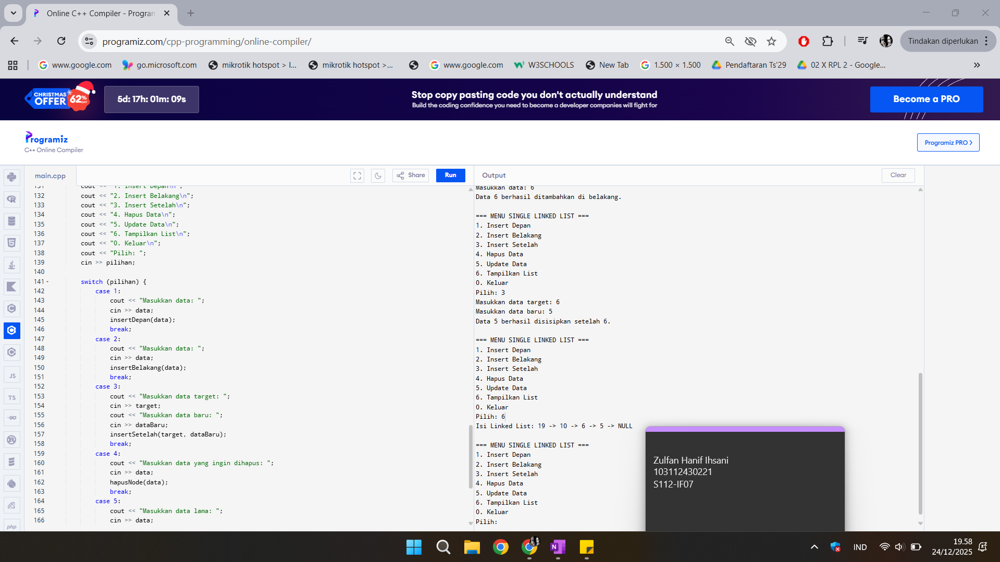
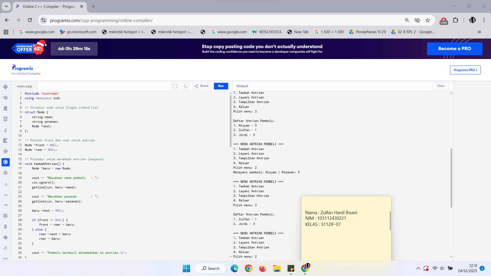
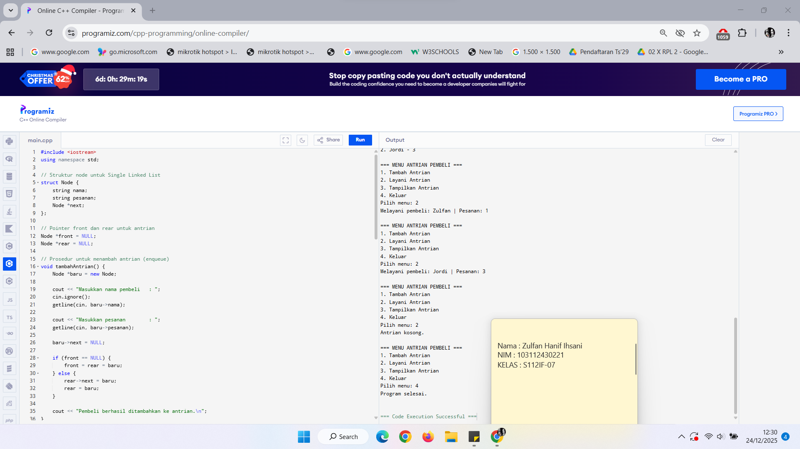
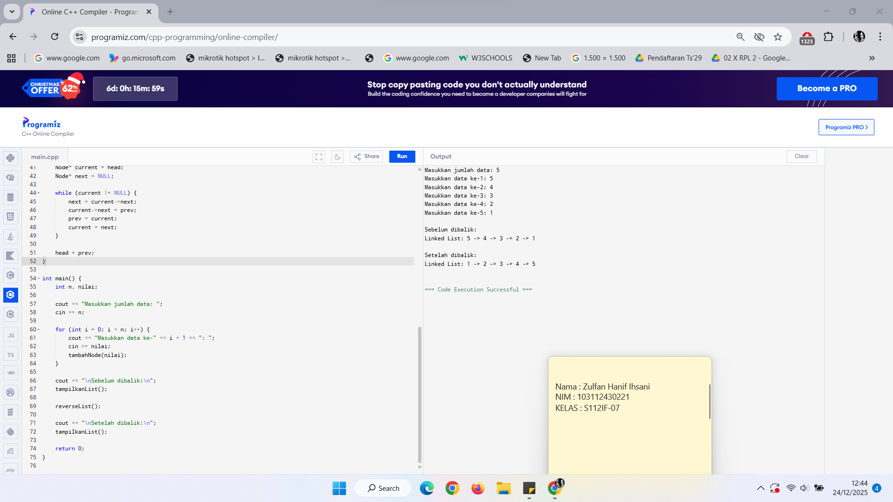

# <h1 align="center">Laporan Praktikum Modul 4 <br> SINGLY LINKED LIST</h1>
<p align="center">ZULFAN HANIF IHSANI - 103112430221</p>

## Dasar Teori

Linked list (biasa disebut list saja) adalah salah satu bentuk struktur data (representasi penyimpanan) berupa serangkaian elemen data yang saling berkait (berhubungan) dan bersifat fleksibel karena dapat tumbuh dan mengerut sesuai kebutuhan. Data yang disimpan dalam Linked list bisa berupa data tunggal atau data majemuk. Data tunggal merupakan data yang hanya terdiri dari satu data (variabel), misalnya: nama bertipe string. Sedangkan data majemuk merupakan sekumpulan data (record) yang di dalamnya terdiri dari berbagai tipe data, misalnya: Data Mahasiswa, terdiri dari Nama bertipe string, NIM bertipe long integer, dan Alamat bertipe string. 

1. Pengertian Linked List

Linked List merupakan salah satu struktur data dinamis yang tersusun atas sekumpulan elemen (node) yang saling terhubung menggunakan pointer. Setiap elemen pada linked list tidak disimpan secara berurutan di memori, melainkan dihubungkan melalui alamat memori dari elemen berikutnya. Struktur data ini bersifat fleksibel karena ukuran data dapat bertambah atau berkurang sesuai kebutuhan.

2. Alasan Penggunaan Pointer pada Linked List

- Implementasi linked list lebih efektif menggunakan pointer dibandingkan array, dengan alasan:
- Array bersifat statis, sedangkan pointer bersifat dinamis.
- Linked list memiliki elemen yang saling terhubung, sehingga lebih mudah dikelola dengan pointer.
- Pointer memudahkan proses penyisipan dan penghapusan elemen.
- Array lebih cocok untuk data dengan jumlah elemen tetap sejak awal.

3. Singly Linked List

Singly Linked List adalah jenis linked list yang setiap nodenya hanya memiliki satu pointer yang menunjuk ke node berikutnya.

Karakteristik Singly Linked List:

- Memiliki satu arah pointer (maju/forward).
- Node terakhir menunjuk ke NULL.
- Penelusuran data hanya dapat dilakukan dari awal ke akhir.
- Penyisipan dan penghapusan data relatif mudah, terutama di tengah list.

4. Komponen Singly Linked List

Setiap elemen dalam Singly Linked List terdiri dari:

Data (info) → menyimpan informasi utama.

- Pointer (next) → menunjuk ke node berikutnya.
- Node/Elemen → tempat penyimpanan data di memori.

Istilah penting:

- First/Head → pointer yang menunjuk ke elemen pertama.
- Next → pointer penghubung ke elemen selanjutnya.
- NULL/Nil → menandakan tidak menunjuk ke elemen mana pun (kosong).

5. Operasi Dasar Singly Linked List

Operasi-operasi dasar (primitif) dalam Singly Linked List meliputi:
- Create List → membuat dan menginisialisasi list kosong.
- Alokasi → menyediakan memori untuk node baru.
- Dealokasi → membebaskan memori node.
- IsEmpty → mengecek apakah list kosong.
- Insert → menambahkan elemen ke dalam list.
- Delete → menghapus elemen dari list.
- View/Traversal → menampilkan seluruh elemen list.
- Update → memperbarui data pada node tertentu.

6. Operasi Insert

Jenis penyisipan data dalam Singly Linked List:
- Insert First → menambahkan elemen di awal list.
- Insert Last → menambahkan elemen di akhir list.
- Insert After → menambahkan elemen setelah node tertentu.

7. Operasi Delete

Jenis penghapusan data dalam Singly Linked List:
- Delete First → menghapus elemen pertama.
- Delete Last → menghapus elemen terakhir.
- Delete After → menghapus elemen setelah node tertentu.
- Delete All → menghapus seluruh elemen dan mengosongkan list.

8. Implementasi ADT Singly Linked List

ADT (Abstract Data Type) Singly Linked List biasanya dibagi ke dalam:
- File header (.h) → berisi deklarasi struktur data dan prototipe fungsi.
- File implementasi (.cpp) → berisi definisi fungsi-fungsi operasi list.
- File main → digunakan untuk menguji dan menjalankan ADT Singly Linked List.

## Guided

### Soal 1

Aku mengerjakan program C++ yang berfungsi untuk mengimplementasikan struktur data Singly Linked List dengan berbagai operasi dasar seperti penambahan data di depan, di belakang, dan setelah data tertentu, serta operasi penghapusan, pembaruan, dan penampilan data. Program ini menggunakan konsep pointer untuk menghubungkan setiap node sehingga membentuk sebuah linked list yang bersifat dinamis.

Tujuan dari program ini adalah untuk memahami cara kerja Singly Linked List serta penggunaan pointer dalam pengelolaan struktur data dinamis pada bahasa pemrograman C++. Melalui program ini, pengguna dapat berinteraksi secara langsung dengan linked list melalui menu yang disediakan.

Program ini menunjukkan bagaimana setiap node saling terhubung melalui pointer next, di mana setiap perubahan data seperti insert, delete, dan update dilakukan dengan memanipulasi alamat memori, bukan sekadar menyalin nilai. Dengan demikian, program ini membantu memahami konsep dasar linked list, alokasi dan dealokasi memori, serta penerapan pointer dalam membangun dan mengelola struktur data Singly Linked List.

> Output
> 

```cpp
#include <iostream>
using namespace std;

// Struktur Node
struct Node {
    int data;
    Node* next;
};

// Pointer awal dan akhir
Node* head = nullptr;

// Fungsi untuk membuat node baru
Node* createNode(int data) {
    Node* newNode = new Node();
    newNode->data = data;
    newNode->next = nullptr;
    return newNode;
}

void insertDepan(int data) {
    Node* newNode = createNode(data);
    newNode->next = head;
    head = newNode;
    cout << "Data" << data << " berhasil ditambahkan di depan.\n";
}


void insertBelakang(int data) {
    Node* newNode = createNode(data);
    if (head == nullptr) {
        head = newNode;
    } else {
        Node* temp = head;
        while (temp->next != nullptr) {
            temp = temp->next;
        }
        temp->next = newNode;
    }
    cout << "Data " << data << " berhasil ditambahkan di belakang.\n";
}

void insertSetelah(int target, int dataBaru) {
    Node* temp = head;
    while (temp != nullptr && temp->data != target) {
        temp = temp->next;
    }

    if (temp == nullptr) {
        cout << "Data " << target << " tidak ditemukan!\n";
    } else {
        Node* newNode = createNode(dataBaru);
        newNode->next = temp->next;
        temp->next = newNode;
        cout << "Data " << dataBaru << " berhasil disisipkan setelah " << target << ".\n";
    }
}

// ========== DELETE FUNCTION ==========
void hapusNode(int data) {
    if (head == nullptr) {
        cout << "List kosong!\n";
        return;
    }

    Node* temp = head;
    Node* prev = nullptr;

    // Jika data di node pertama
    if (temp != nullptr && temp->data == data) {
        head = temp->next;
        delete temp;
        cout << "Data " << data << " berhasil dihapus.\n";
        return;
    }

    // Cari node yang akan dihapus
    while (temp != nullptr && temp->data != data) {
        prev = temp;
        temp = temp->next;
    }

    // Jika data tidak ditemukan
    if (temp == nullptr) {
        cout << "Data " << data << " tidak ditemukan!\n";
        return;
    }

    prev->next = temp->next;
    delete temp;
    cout << "Data " << data << " berhasil dihapus.\n";
}

// ========== UPDATE FUNCTION ==========
void updateNode(int dataLama, int dataBaru) {
    Node* temp = head;
    while (temp != nullptr && temp->data != dataLama) {
        temp = temp->next;
    }

    if (temp == nullptr) {
        cout << "Data " << dataLama << " tidak ditemukan!\n";
    } else {
        temp->data = dataBaru;
        cout << "Data " << dataLama << " berhasil diupdate menjadi " << dataBaru << ".\n";
    }
}

// ========== DISPLAY FUNCTION ==========
void tampilkanList() {
    if (head == nullptr) {
        cout << "List kosong!\n";
        return;
    }

    Node* temp = head;
    cout << "Isi Linked List: ";
    while (temp != nullptr) {
        cout << temp->data << " -> ";
        temp = temp->next;
    }
    cout << "NULL\n";
}

// ========== MAIN PROGRAM ==========
int main() {
    int pilihan, data, target, dataBaru;

    do {
        cout << "\n=== MENU SINGLE LINKED LIST ===\n";
        cout << "1. Insert Depan\n";
        cout << "2. Insert Belakang\n";
        cout << "3. Insert Setelah\n";
        cout << "4. Hapus Data\n";
        cout << "5. Update Data\n";
        cout << "6. Tampilkan List\n";
        cout << "0. Keluar\n";
        cout << "Pilih: ";
        cin >> pilihan;

        switch (pilihan) {
            case 1:
                cout << "Masukkan data: ";
                cin >> data;
                insertDepan(data);
                break;
            case 2:
                cout << "Masukkan data: ";
                cin >> data;
                insertBelakang(data);
                break;
            case 3:
                cout << "Masukkan data target: ";
                cin >> target;
                cout << "Masukkan data baru: ";
                cin >> dataBaru;
                insertSetelah(target, dataBaru);
                break;
            case 4:
                cout << "Masukkan data yang ingin dihapus: ";
                cin >> data;
                hapusNode(data);
                break;
            case 5:
                cout << "Masukkan data lama: ";
                cin >> data;
                cout << "Masukkan data baru: ";
                cin >> dataBaru;
                updateNode(data, dataBaru);
                break;
            case 6:
                tampilkanList();
                break;
            case 0:
                cout << "Program selesai.\n";
                break;
            default:
                cout << "Pilihan tidak valid!\n";
        }
    } while (pilihan != 0);

    return 0;
}
```

## Unguided

### Soal 1

Buatlah single linked list untuk Antrian yang menyimpan data pembeli( nama dan pesanan). program memiliki beberapa menu seperti tambah antrian,  layani antrian(hapus), dan tampilkan antrian. \*antrian pertama harus yang pertama dilayani

```cpp
#include <iostream>
using namespace std;

struct Node {
    string nama;
    string pesanan;
    Node *next;
};

Node *front = NULL;
Node *rear = NULL;

void tambahAntrian() {
    Node *baru = new Node;

    cout << "Masukkan nama pembeli   : ";
    cin.ignore();
    getline(cin, baru->nama);

    cout << "Masukkan pesanan        : ";
    getline(cin, baru->pesanan);

    baru->next = NULL;

    if (front == NULL) {
        front = rear = baru;
    } else {
        rear->next = baru;
        rear = baru;
    }

    cout << "Pembeli berhasil ditambahkan ke antrian.\n";
}

void layaniAntrian() {
    if (front == NULL) {
        cout << "Antrian kosong.\n";
        return;
    }

    Node *hapus = front;
    cout << "Melayani pembeli: " << hapus->nama
         << " | Pesanan: " << hapus->pesanan << endl;

    front = front->next;
    delete hapus;

    if (front == NULL) {
        rear = NULL;
    }
}

void tampilkanAntrian() {
    if (front == NULL) {
        cout << "Antrian kosong.\n";
        return;
    }

    Node *bantu = front;
    int nomor = 1;

    cout << "\nDaftar Antrian Pembeli:\n";
    while (bantu != NULL) {
        cout << nomor << ". "
             << bantu->nama
             << " - " << bantu->pesanan << endl;
        bantu = bantu->next;
        nomor++;
    }
}

int main() {
    int pilihan;

    do {
        cout << "\n=== MENU ANTRIAN PEMBELI ===\n";
        cout << "1. Tambah Antrian\n";
        cout << "2. Layani Antrian\n";
        cout << "3. Tampilkan Antrian\n";
        cout << "4. Keluar\n";
        cout << "Pilih menu: ";
        cin >> pilihan;

        switch (pilihan) {
            case 1:
                tambahAntrian();
                break;
            case 2:
                layaniAntrian();
                break;
            case 3:
                tampilkanAntrian();
                break;
            case 4:
                cout << "Program selesai.\n";
                break;
            default:
                cout << "Pilihan tidak valid.\n";
        }
    } while (pilihan != 4);

    return 0;
}
```

> Output
> 
> 

> Penjelasan

Program ini bertujuan untuk mengimplementasikan struktur data Singly Linked List dalam bentuk antrian (queue) menggunakan bahasa pemrograman C++. Program dirancang untuk menyimpan data pembeli yang terdiri dari nama pembeli dan pesanan, dengan prinsip FIFO (First In First Out), yaitu pembeli yang pertama masuk antrian akan menjadi yang pertama dilayani.

Import Library iostream dan string

Baris #include <iostream> digunakan untuk mengimpor library standar C++ yang menyediakan fungsi input dan output seperti cin dan cout. Library ini memungkinkan program berinteraksi dengan pengguna melalui layar dan keyboard. Sementara itu, #include <string> digunakan untuk mendukung penggunaan tipe data string, yang berfungsi menyimpan data teks seperti nama pembeli dan pesanan. Tanpa library ini, pengolahan data berbentuk teks akan menjadi lebih sulit.

Deklarasi Struktur Node

Struktur Node didefinisikan untuk merepresentasikan satu elemen dalam singly linked list. Di dalam struktur ini terdapat tiga anggota data, yaitu nama untuk menyimpan nama pembeli, pesanan untuk menyimpan pesanan pembeli, serta pointer next yang menunjuk ke node berikutnya. Struktur ini merupakan inti dari singly linked list karena setiap node saling terhubung satu arah melalui pointer next.

Deklarasi Pointer front dan rear

Pointer front dan rear digunakan untuk menandai posisi awal dan akhir dari antrian. Pointer front selalu menunjuk ke node pertama yang akan dilayani, sedangkan pointer rear menunjuk ke node terakhir yang baru saja masuk antrian. Kedua pointer ini diinisialisasi dengan nilai NULL sebagai tanda bahwa antrian masih kosong saat program pertama kali dijalankan.

Fungsi tambahAntrian()

Fungsi tambahAntrian() berfungsi untuk menambahkan pembeli baru ke dalam antrian. Pada fungsi ini, sebuah node baru dibuat menggunakan new. Data nama dan pesanan dimasukkan ke dalam node tersebut, lalu pointer next diatur ke NULL karena node baru selalu berada di akhir antrian. Jika antrian masih kosong, maka front dan rear akan menunjuk ke node baru tersebut. Namun jika antrian sudah berisi data, node baru akan ditambahkan setelah rear, dan pointer rear akan dipindahkan ke node yang baru ditambahkan.

Fungsi layaniAntrian()

Fungsi layaniAntrian() digunakan untuk melayani pembeli yang berada di posisi paling depan antrian. Fungsi ini pertama-tama memeriksa apakah antrian kosong. Jika kosong, maka tidak ada pembeli yang dapat dilayani. Jika tidak kosong, maka node yang ditunjuk oleh front akan dihapus. Pointer front kemudian dipindahkan ke node berikutnya. Jika setelah penghapusan antrian menjadi kosong, maka pointer rear juga diatur menjadi NULL. Proses ini mencerminkan prinsip FIFO, di mana pembeli pertama yang masuk adalah yang pertama dilayani.

Fungsi tampilkanAntrian()

Fungsi tampilkanAntrian() berfungsi untuk menampilkan seluruh data pembeli yang masih berada dalam antrian. Fungsi ini menggunakan pointer sementara untuk menelusuri linked list dari front hingga mencapai NULL. Setiap node yang dilewati akan ditampilkan data nama dan pesanannya. Jika antrian kosong, maka program akan menampilkan pesan bahwa tidak ada data dalam antrian.

Fungsi main()

Fungsi main() merupakan titik awal eksekusi program. Di dalam fungsi ini terdapat menu interaktif yang memungkinkan pengguna memilih operasi yang ingin dilakukan, seperti menambah antrian, melayani antrian, atau menampilkan antrian. Program menggunakan perulangan do-while agar menu terus muncul hingga pengguna memilih opsi keluar. Struktur switch-case digunakan untuk memproses pilihan menu secara terstruktur dan mudah dipahami.

Kesimpulan

Program ini berhasil menerapkan konsep Singly Linked List dalam bentuk antrian (queue) dengan prinsip FIFO. Setiap operasi utama dalam antrian seperti penambahan, penghapusan, dan penampilan data diimplementasikan menggunakan pointer dan node secara dinamis. Dengan program ini, konsep Abstract Data Type (ADT) dapat dipahami secara praktis melalui studi kasus antrian pembeli.

### Soal 2

Buatlah program kode untuk membalik (reverse) singly linked list (1-2-3 menjadi 3-2-1) 

```cpp
#include <iostream>
using namespace std;

struct Node {
    int data;
    Node* next;
};

Node* head = NULL;

void tambahNode(int nilai) {
    Node* baru = new Node;
    baru->data = nilai;
    baru->next = NULL;

    if (head == NULL) {
        head = baru;
    } else {
        Node* temp = head;
        while (temp->next != NULL) {
            temp = temp->next;
        }
        temp->next = baru;
    }
}

void tampilkanList() {
    Node* temp = head;
    cout << "Linked List: ";
    while (temp != NULL) {
        cout << temp->data;
        if (temp->next != NULL)
            cout << " -> ";
        temp = temp->next;
    }
    cout << endl;
}

void reverseList() {
    Node* prev = NULL;
    Node* current = head;
    Node* next = NULL;

    while (current != NULL) {
        next = current->next;   
        current->next = prev;   
        prev = current;         
        current = next;     
    }

    head = prev; 
}

int main() {
    int n, nilai;

    cout << "Masukkan jumlah data: ";
    cin >> n;

    for (int i = 0; i < n; i++) {
        cout << "Masukkan data ke-" << i + 1 << ": ";
        cin >> nilai;
        tambahNode(nilai);
    }

    cout << "\nSebelum dibalik:\n";
    tampilkanList();

    reverseList();

    cout << "\nSetelah dibalik:\n";
    tampilkanList();

    return 0;
}
```

> Output
> 

> Penjelasan

Import Library iostream

Baris #include <iostream> digunakan untuk mengimpor library standar C++ yang menyediakan fasilitas input dan output. Library ini memungkinkan program menerima masukan dari pengguna melalui cin dan menampilkan hasil ke layar menggunakan cout. Tanpa library ini, interaksi antara program dan pengguna tidak dapat dilakukan.

Deklarasi Struktur Node

Struktur Node digunakan untuk merepresentasikan satu elemen dalam singly linked list. Struktur ini memiliki dua anggota, yaitu data yang berfungsi menyimpan nilai integer, dan pointer next yang menunjuk ke node berikutnya. Pointer next menjadi penghubung antar node sehingga membentuk sebuah rantai data satu arah.

Deklarasi Pointer head

Pointer head berfungsi sebagai penunjuk awal linked list. Pointer ini selalu menunjuk ke node pertama dalam linked list. Ketika linked list masih kosong, nilai head adalah NULL. Semua operasi traversal, penambahan, dan pembalikan linked list dimulai dari pointer head.

Fungsi tambahNode()

Fungsi tambahNode() digunakan untuk menambahkan data baru ke dalam linked list. Node baru dibuat secara dinamis menggunakan new, kemudian nilai data dimasukkan ke dalam node tersebut. Jika linked list masih kosong, node baru langsung dijadikan sebagai head. Jika tidak kosong, program akan menelusuri linked list hingga node terakhir, lalu menghubungkan node terakhir tersebut dengan node baru.

Fungsi tampilkanList()

Fungsi tampilkanList() bertujuan untuk menampilkan seluruh isi linked list. Fungsi ini menggunakan pointer sementara untuk menelusuri node mulai dari head hingga mencapai NULL. Setiap data node ditampilkan secara berurutan sehingga pengguna dapat melihat kondisi linked list sebelum dan sesudah proses pembalikan dilakukan.

Fungsi reverseList()

Fungsi reverseList() merupakan inti dari program ini. Proses pembalikan dilakukan dengan menggunakan tiga pointer, yaitu prev, current, dan next. Pointer current digunakan untuk menunjuk node yang sedang diproses, next digunakan untuk menyimpan alamat node berikutnya agar tidak hilang, dan prev digunakan sebagai penunjuk node sebelumnya.
Pada setiap iterasi, arah pointer next dari node saat ini dibalik sehingga menunjuk ke node sebelumnya. Proses ini dilakukan berulang hingga seluruh node diproses. Setelah proses selesai, pointer head diperbarui agar menunjuk ke node terakhir yang kini menjadi node pertama.

Fungsi main()

Fungsi main() merupakan titik awal eksekusi program. Pada fungsi ini, pengguna diminta memasukkan jumlah data dan nilai setiap data yang akan dimasukkan ke dalam linked list. Setelah data dimasukkan, program menampilkan linked list sebelum dibalik, kemudian memanggil fungsi reverseList() untuk membalik urutan node, dan akhirnya menampilkan hasil linked list setelah dibalik.

Kesimpulan

Program ini berhasil menerapkan algoritma pembalikan singly linked list dengan memanfaatkan manipulasi pointer tanpa menggunakan struktur data tambahan. Dengan memahami program ini, mahasiswa dapat memperoleh pemahaman yang lebih baik mengenai konsep pointer, traversal linked list, serta cara kerja operasi reverse yang sering digunakan dalam struktur data.

## Referensi

Shiksha Online. (2022, Mar 24). Singly linked lists. Diambil dari https://www.shiksha.com/online-courses/articles/singly-linked-lists/

GeeksforGeeks. (2025, Dec 11). Linked list data structure. Diambil dari https://www.geeksforgeeks.org/dsa/linked-list-data-structure/

W3Schools. (n.d.). Types of linked lists. Diambil dari https://www.w3schools.com/dsa/dsa_data_linkedlists_types.php

Programiz. (n.d.). Linked list data structure. Diambil dari https://www.programiz.com/dsa/linked-list

Gondi, S. (2024, Oct 25). Introduction to linked lists: Understanding singly linked lists with example in Java. Diambil dari https://gondi-sai.medium.com/introduction-to-linked-lists-understanding-singly-linked-lists-with-example-in-java-dsa-5-29faac656dcd

