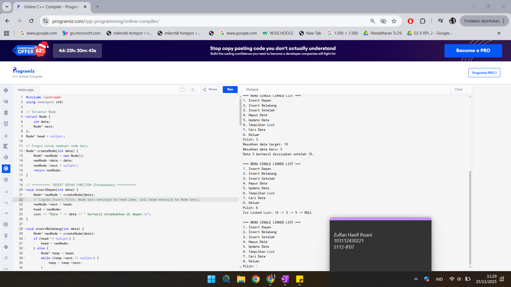
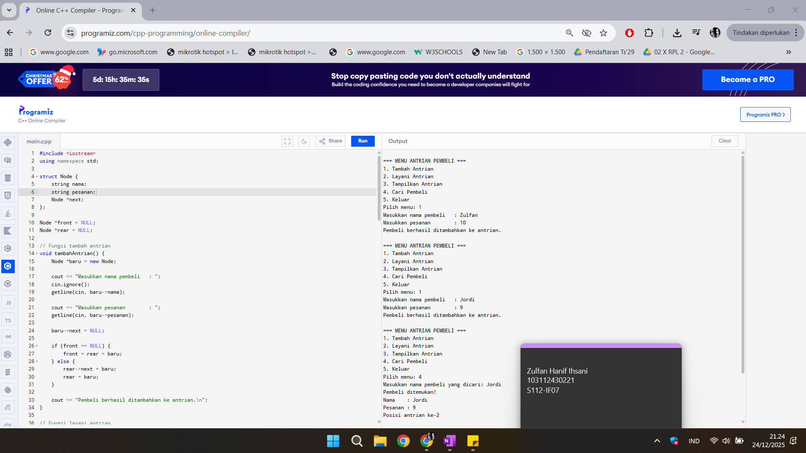
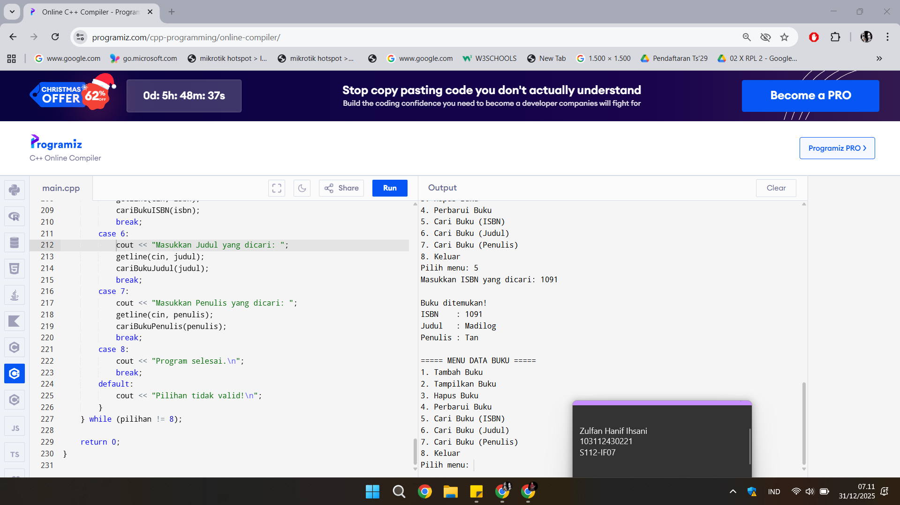

# <h1 align="center">Laporan Praktikum Modul 5 <br> SINGLY LINKED LIST (BAGIAN KEDUA)</h1>
<p align="center">ZULFAN HANIF IHSANI - 103112430221</p>

## Dasar Teori

Pengantar Singly Linked List (Lanjutan)

Singly Linked List merupakan struktur data dinamis yang setiap elemennya (node) saling terhubung menggunakan satu buah pointer yang menunjuk ke node berikutnya. Pada bagian kedua ini, pembahasan difokuskan pada operasi lanjutan yang berhubungan dengan pencarian data, pengolahan isi list, serta manipulasi struktur list secara lebih kompleks.

Operasi Searching

Searching merupakan operasi dasar pada Singly Linked List yang digunakan untuk mencari node tertentu berdasarkan nilai data atau alamat node.

Karakteristik operasi searching:
- Dilakukan dengan menelusuri list dari node pertama (first) hingga akhir.
- Proses berhenti ketika data yang dicari ditemukan atau list habis ditelusuri.
- Searching menjadi dasar untuk operasi lain seperti:
  - Insert After
  - Delete After
  - Update data

Jenis fungsi searching:
- findElm(L, X) → mencari elemen dengan nilai data X, mengembalikan alamat node jika ditemukan.
- fFindElm(L, P) → mengecek apakah alamat node P terdapat di dalam list.
- findBefore(L, P) → mencari node sebelum node P.

3. ADT Singly Linked List

ADT (Abstract Data Type) Singly Linked List menyimpan definisi struktur data dan operasi-operasi primitif yang digunakan dalam pengolahan list.

Komponen utama ADT:
- infotype → tipe data yang disimpan (misalnya integer)
- address → pointer ke node
- ElmList → struktur node yang berisi info dan next
- List → struktur list yang memiliki pointer first
- ADT ini biasanya dibagi dalam:
- File header (.h) → deklarasi tipe data dan prototipe fungsi
- File implementasi (.cpp) → definisi fungsi
- File main → pengujian dan penggunaan ADT

4. Operasi Manipulasi Data

Operasi lanjutan pada Singly Linked List meliputi:

a. Insert
- Insert First → menambah elemen di awal list
- Insert Last → menambah elemen di akhir list
- Insert After → menambah elemen setelah node tertentu

b. Delete
- Delete First → menghapus elemen pertama
- Delete Last → menghapus elemen terakhir
- Delete After → menghapus elemen setelah node tertentu
- Delete by Value (delP) → menghapus elemen berdasarkan nilai data

Semua operasi delete harus diikuti dengan dealokasi memori agar tidak terjadi kebocoran memori.

5. Operasi Tambahan pada List

Selain operasi dasar, Singly Linked List juga memiliki operasi pengolahan lanjutan, antara lain:
- printInfo(L) → menampilkan seluruh isi list
- nbList(L) → menghitung jumlah elemen dalam list
- delAll(L) → menghapus seluruh elemen dan mengosongkan list
- invertList(L) → membalik urutan elemen list
- copyList(L1, L2) → menyalin list dengan alamat node yang sama
- fCopyList(L) → membuat salinan list baru

6. Penerapan Searching dan Pengolahan Data

Pada penerapannya, operasi searching digunakan untuk:
- Menemukan elemen tertentu (misalnya mencari data bernilai 8)
- Menghitung total nilai seluruh elemen list
- Melakukan update atau delete pada node tertentu

Hal ini menunjukkan bahwa Singly Linked List tidak hanya digunakan untuk penyimpanan data, tetapi juga untuk pengolahan data secara terstruktur dan dinamis.

7. Kesimpulan

Singly Linked List bagian kedua menekankan pada operasi pencarian dan manipulasi lanjutan terhadap list. Dengan memahami searching, delete, copy, dan invert list, pengguna dapat mengelola data secara lebih efisien dan fleksibel. Operasi-operasi tersebut menjadi dasar dalam pengembangan struktur data yang lebih kompleks.

## Guided

### Soal 1

Aku mengerjakan program C++ yang berfungsi untuk mengimplementasikan struktur data Singly Linked List dengan berbagai operasi lanjutan seperti penambahan data di depan, di belakang, dan setelah data tertentu, serta operasi penghapusan, pembaruan, dan penampilan data. Program ini menunjukkan bagaimana data disimpan dan dikelola menggunakan node yang saling terhubung melalui pointer, sehingga struktur data dapat berubah secara dinamis.

Tujuan dari program ini adalah untuk memahami konsep Singly Linked List serta penggunaan pointer dan alokasi memori dinamis dalam bahasa pemrograman C++. Melalui program ini, pengguna dapat melakukan manipulasi data secara langsung melalui operasi insert, delete, dan update pada linked list.

Program ini menunjukkan bagaimana setiap operasi pada Singly Linked List dilakukan dengan memanipulasi alamat memori antar node, bukan dengan pemindahan data secara langsung. Dalam C++, hal ini dilakukan dengan mengatur pointer next pada setiap node untuk menghubungkan, menghapus, atau memperbarui elemen dalam list, sehingga perubahan yang dilakukan langsung memengaruhi struktur data yang ada.

> Output
> 

```cpp
#include <iostream>
using namespace std;

// Struktur Node
struct Node {
    int data;
    Node* next;
};

// Pointer awal dan akhir
Node* head = nullptr;

// Fungsi untuk membuat node baru
Node* createNode(int data) {
    Node* newNode = new Node();
    newNode->data = data;
    newNode->next = nullptr;
    return newNode;
}

void insertDepan(int data) {
    Node* newNode = createNode(data);
    newNode->next = head;
    head = newNode;
    cout << "Data" << data << " berhasil ditambahkan di depan.\n";
}


void insertBelakang(int data) {
    Node* newNode = createNode(data);
    if (head == nullptr) {
        head = newNode;
    } else {
        Node* temp = head;
        while (temp->next != nullptr) {
            temp = temp->next;
        }
        temp->next = newNode;
    }
    cout << "Data " << data << " berhasil ditambahkan di belakang.\n";
}

void insertSetelah(int target, int dataBaru) {
    Node* temp = head;
    while (temp != nullptr && temp->data != target) {
        temp = temp->next;
    }

    if (temp == nullptr) {
        cout << "Data " << target << " tidak ditemukan!\n";
    } else {
        Node* newNode = createNode(dataBaru);
        newNode->next = temp->next;
        temp->next = newNode;
        cout << "Data " << dataBaru << " berhasil disisipkan setelah " << target << ".\n";
    }
}

// ========== DELETE FUNCTION ==========
void hapusNode(int data) {
    if (head == nullptr) {
        cout << "List kosong!\n";
        return;
    }

    Node* temp = head;
    Node* prev = nullptr;

    // Jika data di node pertama
    if (temp != nullptr && temp->data == data) {
        head = temp->next;
        delete temp;
        cout << "Data " << data << " berhasil dihapus.\n";
        return;
    }

    // Cari node yang akan dihapus
    while (temp != nullptr && temp->data != data) {
        prev = temp;
        temp = temp->next;
    }

    // Jika data tidak ditemukan
    if (temp == nullptr) {
        cout << "Data " << data << " tidak ditemukan!\n";
        return;
    }

    prev->next = temp->next;
    delete temp;
    cout << "Data " << data << " berhasil dihapus.\n";
}

// ========== UPDATE FUNCTION ==========
void updateNode(int dataLama, int dataBaru) {
    Node* temp = head;
    while (temp != nullptr && temp->data != dataLama) {
        temp = temp->next;
    }

    if (temp == nullptr) {
        cout << "Data " << dataLama << " tidak ditemukan!\n";
    } else {
        temp->data = dataBaru;
        cout << "Data " << dataLama << " berhasil diupdate menjadi " << dataBaru << ".\n";
    }
}

// ========== DISPLAY FUNCTION ==========
void tampilkanList() {
    if (head == nullptr) {
        cout << "List kosong!\n";
        return;
    }

    Node* temp = head;
    cout << "Isi Linked List: ";
    while (temp != nullptr) {
        cout << temp->data << " -> ";
        temp = temp->next;
    }
    cout << "NULL\n";
}

// ========== MAIN PROGRAM ==========
int main() {
    int pilihan, data, target, dataBaru;

    do {
        cout << "\n=== MENU SINGLE LINKED LIST ===\n";
        cout << "1. Insert Depan\n";
        cout << "2. Insert Belakang\n";
        cout << "3. Insert Setelah\n";
        cout << "4. Hapus Data\n";
        cout << "5. Update Data\n";
        cout << "6. Tampilkan List\n";
        cout << "0. Keluar\n";
        cout << "Pilih: ";
        cin >> pilihan;

        switch (pilihan) {
            case 1:
                cout << "Masukkan data: ";
                cin >> data;
                insertDepan(data);
                break;
            case 2:
                cout << "Masukkan data: ";
                cin >> data;
                insertBelakang(data);
                break;
            case 3:
                cout << "Masukkan data target: ";
                cin >> target;
                cout << "Masukkan data baru: ";
                cin >> dataBaru;
                insertSetelah(target, dataBaru);
                break;
            case 4:
                cout << "Masukkan data yang ingin dihapus: ";
                cin >> data;
                hapusNode(data);
                break;
            case 5:
                cout << "Masukkan data lama: ";
                cin >> data;
                cout << "Masukkan data baru: ";
                cin >> dataBaru;
                updateNode(data, dataBaru);
                break;
            case 6:
                tampilkanList();
                break;
            case 0:
                cout << "Program selesai.\n";
                break;
            default:
                cout << "Pilihan tidak valid!\n";
        }
    } while (pilihan != 0);

    return 0;
}
```

## Unguided

### Soal 1

Buatlah single linked list untuk Antrian yang menyimpan data pembeli( nama dan pesanan). program memiliki beberapa menu seperti tambah antrian,  layani antrian(hapus), dan tampilkan antrian. \*antrian pertama harus yang pertama dilayani


```cpp
#include <iostream>
using namespace std;

struct Node {
    string nama;
    string pesanan;
    Node *next;
};

Node *front = NULL;
Node *rear = NULL;

void tambahAntrian() {
    Node *baru = new Node;

    cout << "Masukkan nama pembeli   : ";
    cin.ignore();
    getline(cin, baru->nama);

    cout << "Masukkan pesanan        : ";
    getline(cin, baru->pesanan);

    baru->next = NULL;

    if (front == NULL) {
        front = rear = baru;
    } else {
        rear->next = baru;
        rear = baru;
    }

    cout << "Pembeli berhasil ditambahkan ke antrian.\n";
}

void layaniAntrian() {
    if (front == NULL) {
        cout << "Antrian kosong.\n";
        return;
    }

    Node *hapus = front;
    cout << "Melayani pembeli: " << hapus->nama
         << " | Pesanan: " << hapus->pesanan << endl;

    front = front->next;
    delete hapus;

    if (front == NULL) {
        rear = NULL;
    }
}

void tampilkanAntrian() {
    if (front == NULL) {
        cout << "Antrian kosong.\n";
        return;
    }

    Node *bantu = front;
    int nomor = 1;

    cout << "\nDaftar Antrian Pembeli:\n";
    while (bantu != NULL) {
        cout << nomor << ". "
             << bantu->nama
             << " - " << bantu->pesanan << endl;
        bantu = bantu->next;
        nomor++;
    }
}

void cariPembeli() {
    if (front == NULL) {
        cout << "Antrian kosong.\n";
        return;
    }

    string cariNama;
    cout << "Masukkan nama pembeli yang dicari: ";
    cin.ignore();
    getline(cin, cariNama);

    Node *bantu = front;
    int posisi = 1;
    bool ditemukan = false;

    while (bantu != NULL) {
        if (bantu->nama == cariNama) {
            cout << "Pembeli ditemukan!\n";
            cout << "Nama    : " << bantu->nama << endl;
            cout << "Pesanan : " << bantu->pesanan << endl;
            cout << "Posisi antrian ke-" << posisi << endl;
            ditemukan = true;
            break;
        }
        bantu = bantu->next;
        posisi++;
    }

    if (!ditemukan) {
        cout << "Pembeli dengan nama \"" << cariNama << "\" tidak ditemukan.\n";
    }
}

int main() {
    int pilihan;

    do {
        cout << "\n=== MENU ANTRIAN PEMBELI ===\n";
        cout << "1. Tambah Antrian\n";
        cout << "2. Layani Antrian\n";
        cout << "3. Tampilkan Antrian\n";
        cout << "4. Cari Pembeli\n";
        cout << "5. Keluar\n";
        cout << "Pilih menu: ";
        cin >> pilihan;

        switch (pilihan) {
            case 1:
                tambahAntrian();
                break;
            case 2:
                layaniAntrian();
                break;
            case 3:
                tampilkanAntrian();
                break;
            case 4:
                cariPembeli();
                break;
            case 5:
                cout << "Program selesai.\n";
                break;
            default:
                cout << "Pilihan tidak valid.\n";
        }
    } while (pilihan != 5);

    return 0;
}
```

> Output
> 

> Penjelasan

### Soal 2

Gunakan latihan pada pertemuan minggu ini dan tambahkan searching untuk mencari buku berdasarkan judul, penulis, dan ISBN!

```cpp

```

> Output
> 

> Penjelasan

## Referensi
